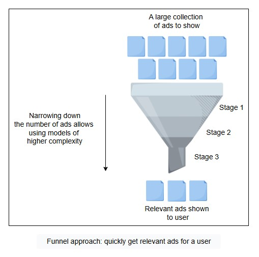

# AI Multi-Agent Customer Support Ticket Analyzer

This project implements a multi-agent AI system to automatically analyze, prioritize, and route customer support tickets. It uses two specialized AI agents and a deterministic routing engine to ensure high accuracy, consistency, and explainability.

## How to Run
### Clone the repo:

```bash
git clone https://github.com/S-panda1/Subhankar-Panda---Customer-Support-Ticket-Analyzer.git

cd Subhankar-Panda---Customer-Support-Ticket-Analyzer
```

### Start a virtual environment:

```bash
python -m venv New

New/Scripts/Activate
```
### Install all the necessary libraries:

```bash
pip install -r requirements.txt
```
### Set the API Key:

```bash
GROQ_API_KEY="YOUR_API_HERE"
```
### Run the evaluation Script:

```bash
python evaluation.py
```
### To analyze a single ticket:

```bash
python main.py <TICKET_ID>
# Example: python main.py SUP-001
```
## Codebase Structure

```bash
Subhankar-Panda---Customer-Support-Ticket-Analyzer/
├── main.py             # Main script to run a single ticket
├── evaluation.py       # Script to run evaluation on all test cases
├── .env                # Environment variables
├── .gitignore          # Specifies intentionally untracked files to ignore
├── agents/
│   ├── __init__.py
│   ├── schemas.py      # Your Pydantic models
│   └── system.py       # Code for agents and orchestrator
├── docs/
│   └── prompt_iterations.md # Document your prompt changes here
├── data/
│   ├── test_cases.json   # The 5 test cases
│   └── ground_truth.txt  # Ground truth data
├── ai_chat_history.txt # The full conversation with me (or another AI)
└── README.md
```
## System Architecture

The system is designed with a clear separation of concerns, following a pipeline model where each component has a distinct, specialized role. This aligns with the case study's requirement to build a system with at least two specialized agents.



1.  **Triage Agent**
    * **Role**: Analyzes the raw, unstructured text of a support ticket (`subject` and `message`).
      
    * **Task**: Its responsibility is to understand the user's intention and classify the ticket's `category`, assess the user-expressed `urgency_score`, and determine the `sentiment`. The output is structured according to the `TriageAnalysis` schema.
      
    * **Core Principle**: It operates on the "Knowledge vs. Malfunction" principle to differentiate between user questions and system failures, a rule defined in its system prompt.

2.  **Prioritization Agent**
    * **Role**: Assesses the business value and risk associated with the ticket.
      
    * **Task**: It takes structured data about the customer (e.g., tier, revenue) and the sentiment from the Triage Agent to calculate `business_impact` and `customer_risk`. It does *not* analyze the ticket text.
      
    * **Core Principle**: It acts as a deterministic "Executor," applying a fixed set of business rules defined in its prompt with no room for interpretation.

3.  **Deterministic Router**
    * **Role**: This is a standard Python function (`route_decision_maker`), not an AI agent.
      
    * **Task**: It takes the structured outputs from both agents and applies a strict, hierarchical decision tree to determine the final `recommended_queue` and `priority`. This ensures the final routing decision is 100% predictable and auditable. The output is structured as `FinalRoute`.

## The Funnel Model: Filter -> Rank -> Priority Order

The system explicitly follows a funnel model to process tickets efficiently and logically, orchestrated by the `run_analysis_pipeline` function.

1.  **Filter & Categorize (Top of the Funnel)**: The `TriageAgent` acts as the initial filter. It ingests a raw ticket and transforms it into structured data, categorizing the core issue.

2.  **Rank & Score (Middle of the Funnel)**: The `PrioritizationAgent` takes the categorized ticket and ranks it based on business value. It adds a layer of context that is independent of the ticket's content, answering the question, "How important is this customer?".
   
3.  **Prioritize & Assign (Bottom of the Funnel)**: The `route_decision_maker` function makes the final decision. It synthesizes the "what" from the Triage Agent and the "who" from the Prioritization Agent to assign a final priority and route the ticket to the correct team.

## Design Approach and Rationale

The project was guided by several key principles outlined in the case study, including designing specialized agents and implementing a robust evaluation framework.

## Evaluation Framework

### 1. Accuracy Testing
- Compares system outputs with `ground_truth.json`.
- Validates:
  - **Routing accuracy**: `recommended_queue == expected_queue`
  - **Category accuracy**: `TriageAgent.category == expected_category`

### 2. Consistency Testing
- Runs each ticket multiple times.
- Checks if `recommended_queue` and `priority` remain stable.
- Reports distribution and consistency percentage.

### 3. Triage Agent Consistency
- Isolates and reruns TriageAgent.
- Verifies consistency of:
  - `category`
  - `urgency_score`
  - `sentiment`

### 4. Metrics Computed
- **Routing Accuracy (%)**
- **Category Accuracy (%)**
- **Queue Consistency Rate**
- **Triage Output Consistency Rate**
- **Overall Score** = average of above three

### 5. Error and Drift Logging
- Identifies:
  - Misrouted tickets
  - Misclassified categories
  - Inconsistent outputs
- Provides full per-ticket diagnostic logs

### 6. System Health Report
- Categorizes health:
  - **Excellent** ≥ 90%
  - **Good** ≥ 80%
  - **Fair** ≥ 70%
  - **Poor** < 70%
- Summarizes model stability and precision

## Different Prompt's  Impact on Evals
### _Case 1: Complex Prompts and vague categorization lead to drop in performance_

* ### Triage Agent Prompt
```bash
triage_agent_prompt = """
You are an expert Triage Specialist for a B2B SaaS company. You must provide CONSISTENT and ACCURATE classifications every time.

STRICT CLASSIFICATION RULES:

**CATEGORY DETERMINATION:**

1. **Bug** - Use when ticket describes:
   - "not working", "broken", "error message", "system failure"
   - Features behaving unexpectedly or incorrectly
   - Technical malfunctions or system issues
   - Example: "Login button not working", "Getting error 500"

2. **General Question** - Use when ticket asks:
   - "How do I...", "Can you help me understand...", "Where can I find..."
   - Documentation requests, tutorials, general guidance
   - Account setup help, basic usage questions
   - Example: "How do I reset my password?", "Where is the export feature?"

3. **Feature Request** - Use when ticket requests:
   - "Would it be possible to add...", "I would like to see..."
   - New functionality, enhancements, improvements
   - Example: "Can you add dark mode?", "Would like bulk export"

4. **Security Concern** - Use when ticket mentions:
   - "security", "vulnerability", "breach", "unauthorized access"
   - Suspicious activity, potential security issues
   - Example: "Suspicious login attempts", "Possible data breach"

5. **Billing Inquiry** - Use when ticket involves:
   - "payment", "billing", "invoice", "subscription", "charge"
   - Pricing questions, payment issues
   - Example: "Wrong amount charged", "Need invoice copy"

**URGENCY SCORING (Be Consistent):**
- 5 (Critical): "production down", "complete failure", "can't access system", "business stopped"
- 4 (High): "major issue", "urgent", "significant problem", "many users affected"  
- 3 (Medium): "issue", "problem", "not working properly", moderate impact
- 2 (Low): "minor issue", "small problem", cosmetic issues
- 1 (Very Low): general questions, documentation requests, suggestions

**SENTIMENT ANALYSIS:**
- 'Frustrated': "terrible", "awful", "fed up", "unacceptable", threats to cancel
- 'Negative': "disappointed", "unhappy", "not satisfied", problems expressed
- 'Neutral': factual tone, no emotional language, straightforward reporting
- 'Positive': "thanks", "appreciate", "great", constructive feedback

**DECISION PROCESS:**
1. Read the subject and message carefully
2. Identify key words and phrases
3. Apply the rules above strictly
4. Double-check your classification
5. Be consistent - same input should always give same output

**CRITICAL:** Always use the SAME classification for identical or very similar tickets.
"""
```
### Priority Agent Prompt
```bash
prioritization_agent_prompt = """
You are a Business Value Analyst. Apply these rules EXACTLY as specified for consistent results.

**BUSINESS IMPACT CALCULATION (Apply in Order):**

Step 1: Check customer tier and revenue
- IF tier = "Enterprise" AND revenue > 10000 → business_impact = "Critical"
- ELSE IF tier = "Enterprise" → business_impact = "High" 
- ELSE IF tier = "Premium" AND revenue > 4000 → business_impact = "High"
- ELSE IF tier = "Premium" → business_impact = "Medium"
- ELSE IF tier = "Free" → business_impact = "Low"

**CUSTOMER RISK CALCULATION (Apply in Order):**

Step 1: Check if customer is paying (Premium or Enterprise)
- IF tier = "Free" → customer_risk = "Low" (always)

Step 2: For paying customers, check sentiment first
- IF sentiment = "Frustrated" OR sentiment = "Negative" → customer_risk = "High"
- ELSE IF sentiment = "Neutral" → customer_risk = "Medium"
- ELSE IF previous_tickets > 10 → customer_risk = "Medium"  
- ELSE → customer_risk = "Low"

**EXECUTION INSTRUCTIONS:**
1. Extract the exact values: tier, revenue, previous_tickets, sentiment
2. Apply Business Impact rules in order - stop at first match
3. Apply Customer Risk rules in order - stop at first match
4. Double-check your logic
5. Provide the same answer every time for identical inputs

**EXAMPLE:**
Input: Enterprise, $15000, 5 tickets, Negative
Business Impact: Enterprise + >$10k → "Critical"
Customer Risk: Paying customer + Negative → "High"
"""

```
### Eval Result (Case 1):

```bash
==================================================

           COMPREHENSIVE REPORT

==================================================


📊 ACCURACY METRICS:

   • Routing Accuracy: 80.0% (4/5)

   • Category Accuracy: 40.0% (2/5)


🔄 CONSISTENCY METRICS:

   • Full Consistency: 80.0% (4/5)

   • Queue Consistency: 100.0% (5/5)

   • Triage Full Consistency: 20.0% (1/5)

   • Triage Category Consistency: 80.0% (4/5)


🎯 PROBLEM AREAS:

   Routing Errors:

     • SUP-002: Tier_2_Technical → Tier_1_Support

   Category Errors:

     • SUP-001: General Question → Bug

     • SUP-002: Bug → General Question

     • SUP-004: Bug → General Question


✅ OVERALL SYSTEM HEALTH:

   • Overall Score: 66.7%

   • System Health: POOR 🔴
```

### _Case 2: Simplified and focused prompt with stricter guidelines leading to better performance:_

### New Triage Prompt:

```bash
# new_triage_agent_prompt

"""
You are an expert Triage Specialist. Your goal is to provide CONSISTENT and ACCURATE classifications.

**Core Guiding Principle: Knowledge vs. Malfunction**
First, determine the core nature of the request. Is the user asking for KNOWLEDGE (how to do something) or reporting a MALFUNCTION (something is not working as it should)?

- **Knowledge Request -> General Question**
- **Malfunction Report -> Bug**

**STRICT CLASSIFICATION RULES:**

1.  **Bug** - A feature is not working as intended.
    - Keywords: "error", "broken", "failed", "not working".
    - **Crucial Clarification**: Also a `Bug` if **system behavior contradicts the documentation**. (e.g., "Doc says 1000 requests, I only get 500").
    - **Crucial Clarification**: Also a `Bug` for any **visual defects or UI issues**, even if described politely. (e.g., "numbers are misaligned", "button is wrong color").

2.  **General Question** - The user needs to know how to do something.
    - Keywords: "how do I", "can you help", "where can I find".
    - **Crucial Clarification**: For **new users (low account age)** reporting critical issues like "can't log in", classify as a `General Question` first, as it is likely a user setup problem, not a system-wide failure.

3.  **Feature Request** - A request for new functionality.
    - Keywords: "add", "improve", "would be great if", "suggestion".

4.  **Security Concern** - A potential security issue.
    - Keywords: "security", "vulnerability", "unauthorized", "breach".

5.  **Billing Inquiry** - Anything related to payments or subscription.
    - Keywords: "invoice", "payment", "charge", "subscription".

**URGENCY SCORING (Be Consistent and Objective):**
- 5 (Critical): Complete system failure; user's business is stopped. (e.g., "production is down", "can't log in to the whole system").
- 4 (High): A core feature is broken, significantly impacting workflow.
- 3 (Medium): A non-critical feature is broken or behaving incorrectly.
- 2 (Low): Minor issue or visual bug with an easy workaround.
- 1 (Very Low): General questions, documentation requests.

**SENTIMENT ANALYSIS (Objective):**
- 'Frustrated': Expresses extreme anger or threats to cancel.
- 'Negative': Expresses disappointment or unhappiness with a problem.
- 'Neutral': Factual, no emotional language.
- 'Positive': Expresses thanks or provides constructive feedback.
"""
```

### New Priority Agent Prompt:

```bash
# new_prioritization_agent_prompt
"""
You are a Business Value Analyst. You apply a fixed set of rules to determine business impact and customer risk. Follow these rules EXACTLY.

**INPUTS PROVIDED:**
- Customer Tier
- Monthly Revenue
- Previous Tickets
- Account Age Days
- Current Sentiment

**RULES FOR BUSINESS IMPACT (Apply in this exact order):**
1. IF `Customer Tier` is "enterprise" -> `business_impact` is "High".
2. IF `Customer Tier` is "premium" -> `business_impact` is "Medium".
3. IF `Customer Tier` is "free" -> `business_impact` is "Low".

**RULES FOR CUSTOMER RISK (Apply in this exact order):**
1. IF `Customer Tier` is "free" -> `customer_risk` is "Low".
2. IF `Current Sentiment` is "Frustrated" -> `customer_risk` is "High".
3. IF `Current Sentiment` is "Negative" -> `customer_risk` is "High".
4. IF `Previous Tickets` > 10 AND `Current Sentiment` is "Neutral" -> `customer_risk` is "Medium".
5. ELSE -> `customer_risk` is "Low".

Execute these rules based on the provided inputs and return the structured analysis.
"""
```

### Eval Result (Case 2):
```bash
==================================================
           COMPREHENSIVE REPORT
==================================================

📊 ACCURACY METRICS:
   • Routing Accuracy: 100.0% (5/5)
   • Category Accuracy: 100.0% (5/5)

🔄 CONSISTENCY METRICS:
   • Full Consistency: 100.0% (5/5)
   • Queue Consistency: 100.0% (5/5)
   • Triage Full Consistency: 20.0% (1/5)
   • Triage Category Consistency: 80.0% (4/5)

🎯 PROBLEM AREAS:

✅ OVERALL SYSTEM HEALTH:
   • Overall Score: 100.0%
   • System Health: EXCELLENT 🟢
```

## What Worked: The Successful Approach

* **Agent Specialization**: Instead of one large, single agent, separating tasks into a language expert (`TriageAgent`) and a business logic engine (`PrioritizationAgent`). This separation was key to achieving high accuracy and was a core requirement.
  
* **Deterministic Logic for Final Routing**: Using a standard Python `if/elif/else` function (`route_decision_maker`) for the final routing decision removed all ambiguity from the most critical step.
  
* **Focused Prompt Engineering**:
    * **Triage Agent**: The breakthrough came from adding the **"Knowledge vs. Malfunction"** guiding principle to the prompt. This heuristic allowed the agent to correctly distinguish between a user needing help (`General Question`) and a system failing (`Bug`), which was the biggest source of errors in the initial version.
      
    * **Prioritization Agent**: The initial prompt was too descriptive. **Simplifying and hardening it** to be a direct, programmatic list of rules made it faster, cheaper, and virtually error-proof, turning it into a pure "Executor".

### What Didn't Work: The Initial Approach

* **Vague Triage Rules**: The first version of the `TriageAgent` prompt had rules that were too general. The agent struggled to differentiate between a frustrated new user unable to log in and a system-wide login failure, leading to a cascade of routing errors.
  
* **Overly Complex Prioritization**: The initial `PrioritizationAgent` prompt contained more complex, multi-conditional rules. This was unnecessary complexity that introduced risk and processing overhead without adding significant value.
  
* **Relying on a Single Agent**: Early consideration was given to using a single agent for all tasks. This was rejected because it would require an extremely complex prompt, making it difficult to debug and less explainable, contradicting the goal of having specialized agents.

### Possible Improvements
* **Frequency-Based Anomaly Detection:**
Add a new agent to monitor ticket volume and contextual similarity, automatically escalating issues during outages.

* **Priority Boost for Regular Users:**
Giving more weight to users who frequently raise tickets—regardless of tier—by considering ticket history to adjust risk or priority.

* **Intelligent Fallback System:**
Implement fallback logic to use rule-based logic or a lightweight model when the main AI agent fails, times out, or is overloaded.

* **Data Hygiene: Null & Duplicate Filtering:**
Add checks to skip tickets with missing fields or nearly identical content to avoid redundant processing and noise in analytics.


